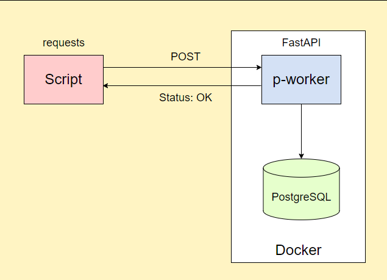

# Приложение с использованием Python(FastAPI), PostgreSQL, Docker

## Задание для реализации

### Нужно написать два скрипта на языке программирования Python. 
**1 скрипт**: Отправляет POST запрос во второй скрипт - отправляет список слов  
**2 скрипт** : Принимает POST запрос с использованием библиотеки FastAPI, подключается к БД и добавляет полученные данные в БД

2 скрипт и БД помещаются в отдельные контейнеры Docker




## Реализация
- **script.py** - отправляет POST запрос
- **p_worker** - принимает POST запрос(FastAPI) и добавляет данные в БД
- **Dockerfile** - настройки для построения образа Docker для p_worker.py
- **docker-compose** - описываются сервисы для определения и запуска многоконтейнерного Docker-приложения


## Запуск приложения
### Для запуска приложения необходимо:
- Установить Docker (Docker Engine для Linux, Docker Desktop для Mac и Windows)
- Запустить Docker (открыть терминал и проверить запуск Docker командой ```docker -version```)
- Открыть корневую папку проекта
- Открыть терминал из текущей папки
- Переходим в папку приложения командой ```cd app``` и вводим следующую команду ```docker-compose up --build``` для развертывания сервисов и создания из docker-образов новых контейнеров. Запустяться контейнеры для приложения с FastAPi и для PostgreSQL
- Возвращаемся в корневую папку командой ```cd ../``` и запускаем скрипт `script.py` командой ```python script.py```
- Готово ;)
